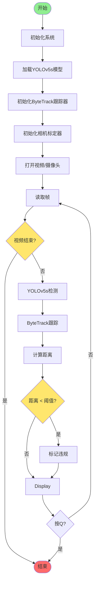
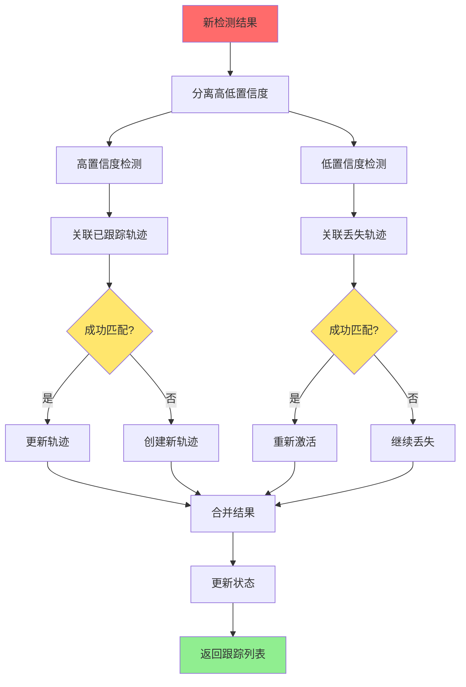
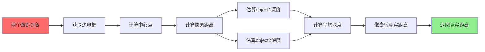
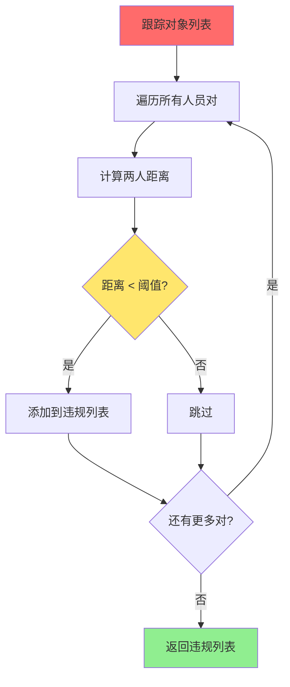

# 系统流程图

## 1. 整体流程图



## 2. 检测模块详细流程

```mermaid
graph LR
    A[原始图像] --> B[预处理]
    B --> C[RGB转换]
    C --> D[Resize到640/1280]
    D --> E[归一化/255]
    E --> F[转Tensor]
    F --> G[添加batch维度]
    G --> H[YOLOv5推理]
    H --> I[NMS后处理]
    I --> J[解析结果]
    J --> K[过滤非person类]
    K --> L[转换为tlwh格式]
    L --> M[返回检测列表]

    style A fill:#FF6B6B
    style M fill:#90EE90
```



## 3. ByteTrack跟踪流程



## 4. 距离计算流程



## 5. 违规检测流程



## 6. 完整时序图

```
主循环流程（每帧执行）:

┌──────────┐   ┌──────────┐   ┌──────────┐   ┌──────────┐   ┌──────────┐
│   读取    │──▶│   检测    │──▶│   跟踪    │──▶│  距离计算 │──▶│   显示    │
│   帧     │   │ YOLOv5s  │   │ ByteTrack│   │ 标定     │   │ 可视化   │
└──────────┘   └──────────┘   └──────────┘   └──────────┘   └──────────┘
     │              │                │                │                │
     │              ▼                ▼                ▼                ▼
     │         [bbox,score]    [track_id]      [real_dist]    [draw box]
     │              │                │                │                │
     │              └────────────────┴────────────────┘                │
     │                            │                                    │
     │                            ▼                                    │
     │                     违规检测与标记                                │
     │                            │                                    │
     │                            ▼                                    │
     └────────────────────────── 显示────────────────────────────────┘
```

## 7. 关键算法伪代码

### 7.1 YOLOv5检测
```python
def detect(frame):
    # 预处理
    img_rgb = cv2.cvtColor(frame, BGR2RGB)
    img_tensor = resize_normalize(img_rgb)

    # 推理
    results = model(img_tensor)

    # 后处理
    detections = []
    for box in results:
        if box.conf > threshold and box.cls == 0:  # person
            detections.append([box.tlwh, box.conf, 0])

    return detections
```

### 7.2 ByteTrack跟踪
```python
def update(detections, frame_id):
    # 分离置信度
    high_conf = [d for d in detections if d.conf > high_thresh]
    low_conf = [d for d in detections if conf between thresholds]

    # 关联已跟踪
    matched_tracks = associate(tracked_stracks, high_conf)
    update_matched(matched_tracks)

    # 关联丢失轨迹
    unmatched_tracks = get_unmatched(tracked_stracks)
    reactivated = associate(lost_stracks, high_conf)
    reactivate(reactivated)

    # 处理低置信度
    if low_conf:
        associate_unmatched(unmatched_tracks, low_conf)

    # 创建新轨迹
    create_new_tracks(unmatched_high_conf)

    # 更新状态
    mark_lost(unmatched)
    mark_removed(timeout)

    return active_tracks
```

### 7.3 距离计算
```python
def calculate_distance(person1, person2):
    # 获取边界框
    box1 = person1.tlwh
    box2 = person2.tlwh

    # 计算像素距离（中心点）
    center1 = [box1[0] + box1[2]/2, box1[1] + box1[3]]
    center2 = [box2[0] + box2[2]/2, box2[1] + box2[3]]
    pixel_dist = norm(center1 - center2)

    # 估算真实距离
    dist1 = estimate_depth(box1)
    dist2 = estimate_depth(box2)
    avg_dist = (dist1 + dist2) / 2

    # 转换为真实距离
    real_dist = pixel_to_real(pixel_dist, avg_dist)

    return real_dist
```

### 7.4 违规检测
```python
def detect_violations(tracks):
    violations = []
    for i, p1 in enumerate(tracks):
        for j, p2 in enumerate(tracks):
            if i >= j:
                continue
            dist = calculate_distance(p1, p2)
            if dist < min_safe_distance:
                violations.append((p1.id, p2.id, dist))
    return violations
```

## 8. 文件结构说明

```
项目根目录/
├── main.py              # 主程序入口
├── detection.py          # YOLOv5检测模块
├── tracker.py            # ByteTrack跟踪模块
├── camera_calibrate.py   # 相机标定与距离估算
├── config.py            # 配置文件
├── requirements.txt      # 依赖列表
├── yolov5s.pt           # 检测模型
├── 文档/
│   ├── README.md
│   ├── 系统架构文档.md
│   ├── 流程图.md
│   ├── 提高检测精度.md
│   └── 距离映射原理.md
└── 输出/
    └── result_*.jpg     # 保存的结果图片
```

